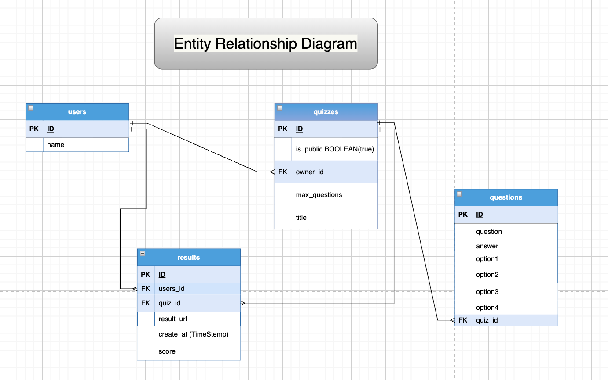
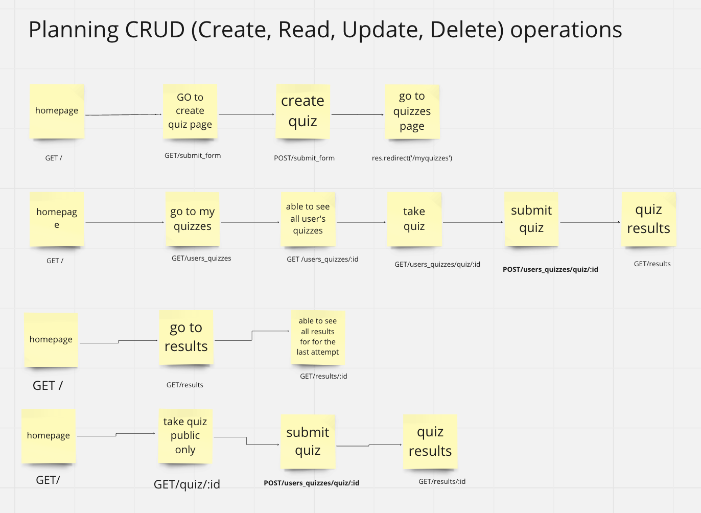

Midterm Project
=========
### Quiz App
Quiz app is a multiple-pages app that you can use to create, take and share quizzes. The users will be able to see their recent attempts at a quiz after completing them.

## Planning Directory. 
### Users Stories.
- As a logged-in user, I can see a list of public quizzes
- As a logged-in user, I can create a quiz
- As a logged-in user, I can make quizzes private
- As a logged-in user, I can provide a URL link to a single quiz to someone, and a person can take a quiz without logging into the app
- As a logged-in user, I can attempt a quiz
- As a logged-in user, I can see the result of my recent attempt
- As a logged-in user, I can share a link to my result and non-user can see it
- As a non-logged-in user, I can't create a quiz and see public quizzes

## DEMO

## 

## Getting Started

1. Create the `.env` by using `.env.example` as a reference: `cp .env.example .env`
2. Update the .env file with your correct local information 
  - username: `labber` 
  - password: `labber` 
  - database: `midterm`
3. Install dependencies: `npm i`
4. Fix to binaries for sass: `npm rebuild node-sass`
5. Reset database: `npm run db:reset`
  - Check the db folder to see what gets created and seeded in the SDB
7. Run the server: `npm run local`
  - Note: nodemon is used, so you should not have to restart your server
8. Visit `http://localhost:8080/`

## Warnings & Tips

- Do not edit the `layout.css` file directly, it is auto-generated by `layout.scss`.
- Split routes into their own resource-based file names, as demonstrated with `users.js` and `widgets.js`.
- Split database schema (table definitions) and seeds (inserts) into separate files, one per table. See `db` folder for pre-populated examples. 
- Use helper functions to run your SQL queries and clean up any data coming back from the database. See `db/queries` for pre-populated examples.
- Use the `npm run db:reset` command each time there is a change to the database schema or seeds. 
  - It runs through each of the files, in order, and executes them against the database. 
  - Note: you will lose all newly created (test) data each time this is run, since the schema files will tend to `DROP` the tables and recreate them.

## Dependencies

- Node 10.x or above
- NPM 5.x or above
- PG 6.x
- "bcrypt": "^5.1.0",
- "chalk": "^2.4.2",
- "dotenv": "^2.0.0",
- "ejs": "^2.6.2",
- "express": "^4.17.1",
- "morgan": "^1.9.1",
- "pg": "^8.5.0",
- "sass": "^1.35.1"

## devDependencies
- "nodemon": "^2.0.10"

## Contributors
`https://github.com/KShilina `
`https://github.com/sharleenb `
`https://github.com/lukechamberland ` 
